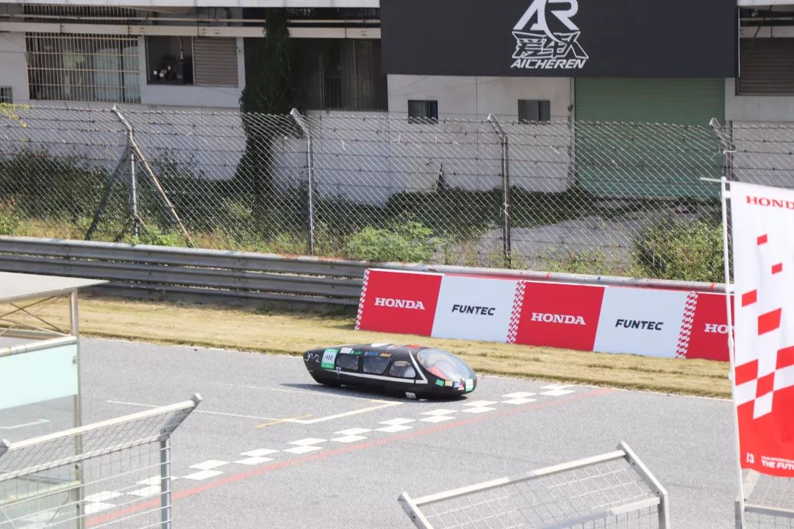
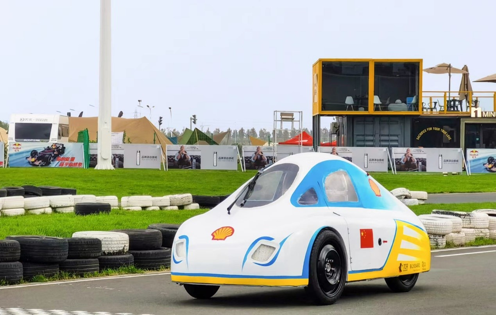

Latest Update: 5th Jan. 2024 &nbsp; [中文版本 (Chinese Version)](https:/xuanlinzeng.github.io/file/other-projects-zh/)

# Practice Projects

## Development and Application of Model Predictive Control (MPC) Technology for Commercial Vehicles-Research on anticipatory driving technology based on MPC
- Predictive Cruise Control (PCC) for Commercial Vehicles.
- I conducted simulation testing and real vehicle tuning at the Electronic Control Department of Dongfeng Commercial Vehicle Technology Center in Wuhan, Hubei Province. The tasks included ensuring consistency between embedded control algorithms and Simulink control algorithms, optimizing existing embedded control algorithms, and performing SIL (Software-in-the-Loop) and HIL (Hardware-in-the-Loop) tests, followed by results comparison.
- Familiar with the use of TRACE, Vehicle Spy, and other hardware simulation tool chains, and carry out the "Wuhan - Xiaogan" freeway segment of real-vehicle MPC road test.

 

---

# Competition Projects
## Jilin University (JLU) Conception-Eco Racing Team

  

    

      
JLU Conception-Prototype

      
      

 <!-- 调整高度，根据需要进行更改 --> 
      
JLU Conception-UC

      
    

  

  

- The JLU Conception-Eco Racing Team aims to design and develop cars with better fuel economy, with the goal of making a liter of fuel go further. As the team leader of the vehicle body group, my responsibility is to lead the research and development of the vehicle body and chassis. Through our team's efforts, we have won numerous national championships.
- Design and process the frame & body of the Prototype in the 2019 season: Raindrop-type lightweight body, Drag coefficient is reduced to 0.1Cd, Line optimization painting makes it more streamlined, Anti-roll frame improves safety, Optimize the body layering, Improve the rigidity, Reducing weight. Won the runner-up in the fuel group of the Shell ECO-Marathon (SEM) (1043.08km/L) and the Honda China Energy Conservation Competition (687.8km/L), Excellent Team Award in EV Group.
- Model the frame & body of the Urban Concept Car (UC) in the 2020 season: Design the body of the first UC in the team’s history, Analyze wind resistance and external flow field, Complete the ergonomics design, Solve the driver's escape and vision to ensure the passive safety. Won the third runner-up of the SEM Online Race and the only UC Design Award in the field.

 

---

## Winter Camp Participant of Machine Learning Plus in Autonomous Driving Program (Online)
- **Feb. 2021  - March 2021**: Computer Science and Artificial Intelligence Laboratory ([CSAIL](https://www.csail.mit.edu/)), Massachusetts Institute of Technology (MIT), Cambridge, MA, USA