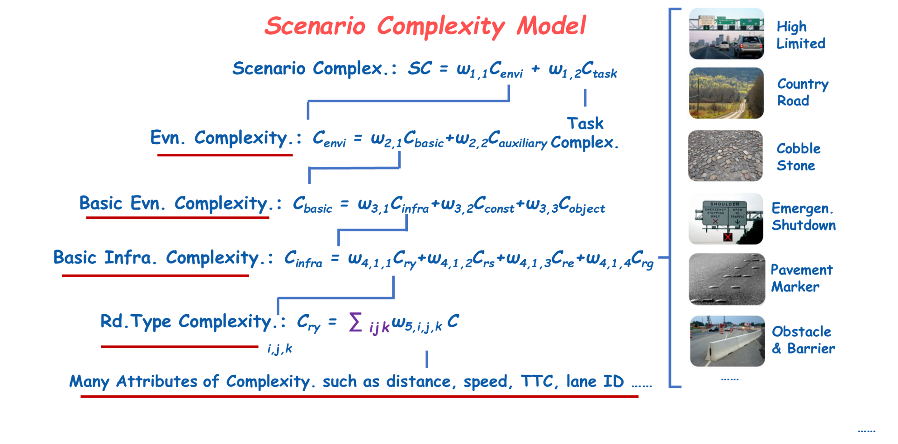

Lastest Update: 5th Jan. 2024&nbsp;  [中文版本 (Chinese Version)](https://xuanlinzeng.github.io/file/publications-zh/)

# Conference Paper

- Coming soon... 🚀

 

---

# Journal Paper

- Coming soon... 🚀

 

---

# Working Manuscript

## Energy-Oriented Multi-Vehicle Cooperative Control under V2X Environment: A Review (Under Review)

**Xuanlin Zeng**, [Lulu Guo](https://scholar.google.com/citations?user=0sUbiwQAAAAJ), [Xuan Li](https://scholar.google.com/citations?user=AYozSzMAAAAJ), [Hong Chen](https://scholar.google.com/citations?user=n_eA148AAAAJ)

**Submitted to IEEE Transactions on Intelligent Vehicles (JCR Q1, IF=8.2)**

[**Publication**](XXXXX)
-🚀 Coming Soon~

<!-- Leveraging vehicle-to-everything (V2X) communication, multi-vehicle cooperative control shows promising potential for enhancing traffic efficiency and energy saving. However, current research primarily focuses on single-vehicle or simplistic platoon control, limiting the scope to addressing diverse single-lane platoons, intricate multi-lane cooperation mechanisms, homogeneous or heterogeneous systems, and advanced energy-efficient control algorithms. To promote the application of multi-vehicle cooperative energy-efficient control in intelligent transportation systems, this paper presents a comprehensive review of the recent progress and challenges. Existing literature is categorized by scenario variations into the platoon level and the traffic level studies. Furthermore, distinctions between homogeneous and heterogeneous multi-vehicle systems are discussed. Moreover, algorithms based on models and learning are elaborately introduced and analyzed. Finally, this paper presents discussions and outlines prospective future directions to guide readers.
-->

 

---

# Patents

## A Scenario Complexity Model Construction Method Based on Autonomous Driving

[Yulei Wang](https://ieeexplore.ieee.org/author/37085365131), **Xuanlin Zeng**, [Yanjun Huang](https://scholar.google.com/citations?user=r_XUM78AAAAJ), [Lulu Guo](https://scholar.google.com/citations?user=0sUbiwQAAAAJ), [Lin Zhang](https://ieeexplore.ieee.org/author/37538577800), [Hong Chen](https://scholar.google.com/citations?user=n_eA148AAAAJ)

**CN Patent: CN 116090334 A**

[**Publication**](https://kns.cnki.net/kcms2/article/abstract?v=j6HAoO1nZAzkvm6MpJHoWmBDJ2BW2KtBnB4STXfe_pNEoLN8cD9-fMOJLH8TqeJSLwUrGghTFGW5L50LZTymV3kXgDyNFd3nOzU7gYlERTO8Qx1wBLHFGcJdO261w1A_DlevaQ671cg=&uniplatform=NZKPT&language=CHS) [**Download**](https://github.com/XuanlinZeng/My_Publications/blob/main/%E5%8F%91%E6%98%8E%E5%85%AC%E5%BC%80-%E4%B8%80%E7%A7%8D%E5%9F%BA%E4%BA%8E%E8%87%AA%E5%8A%A8%E9%A9%BE%E9%A9%B6%E7%9A%84%E5%9C%BA%E6%99%AF%E5%A4%8D%E6%9D%82%E5%BA%A6%E6%A8%A1%E5%9E%8B%E6%9E%84%E5%BB%BA%E6%96%B9%E6%B3%95.pdf)
- This invention pertains to a method for constructing a scenario complexity model based on autonomous driving, comprising the following steps: determining complexity weight factors in autonomous driving tasks; establishing a complexity model for autonomous driving tasks based on the complexity weight factors; building a scenario complexity model based on the autonomous driving task complexity model. The autonomous driving tasks encompass localization tasks, perception tasks, and control tasks. In contrast to existing technology, this invention takes into consideration the complexity and weight factors of various factors involved in dynamic driving tasks: localization, perception, and control. It constructs a scenario complexity model with a neural network-like structure. This model can provide a theoretical foundation and scientific basis for autonomous vehicle testing and evaluation, industry standards, and the formulation of relevant legal regulations.

 

---

# Thesis
- Coming soon... 🚀

 
